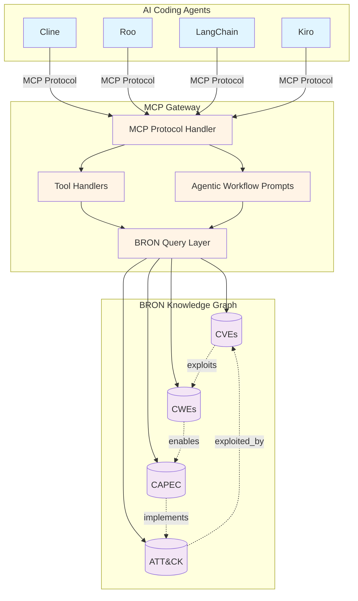
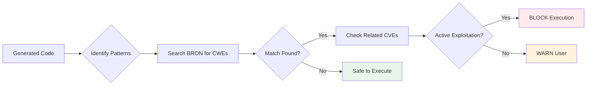
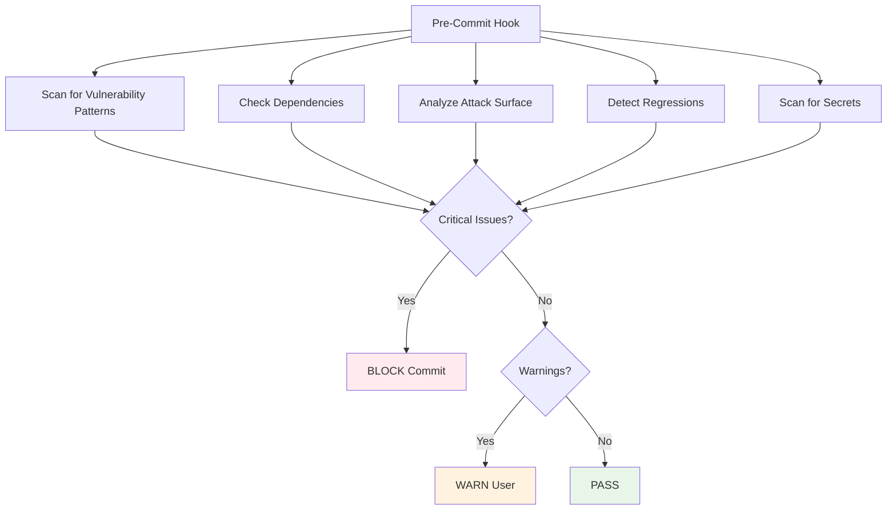
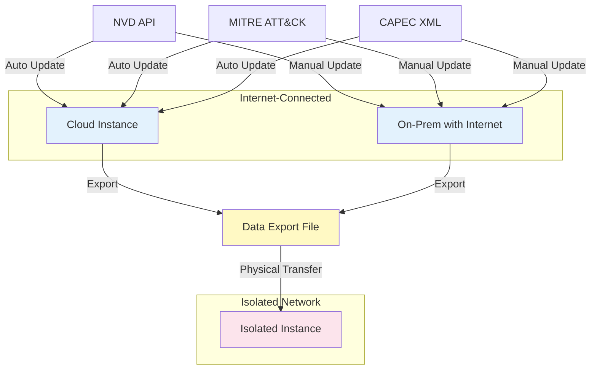

# MCP-BRON Integration Spec

> **Design specification for integrating BRON cybersecurity knowledge graph with AI coding agents via Model Context Protocol (MCP)**

This repository contains a comprehensive specification for building an MCP gateway to BRON (Bridging Reconnaissance and Operational Nexus), enabling AI agents like Cline, Roo, LangChain, and Kiro to leverage cybersecurity intelligence for safer code generation, dependency vetting, and vulnerability-aware development workflows.

## 📋 Table of Contents

- [What is BRON?](#what-is-bron)
- [What is MCP?](#what-is-mcp)
- [Why Integrate BRON with AI Agents?](#why-integrate-bron-with-ai-agents)
- [Architecture Overview](#architecture-overview)
- [Agentic Workflows](#agentic-workflows)
- [Specification Documents](#specification-documents)
- [Use Cases](#use-cases)
- [Deployment Scenarios](#deployment-scenarios)
- [Getting Started](#getting-started)
- [Contributing](#contributing)
- [License](#license)

## What is BRON?

**BRON (Bridging Reconnaissance and Operational Nexus)** is a cybersecurity knowledge graph that connects multiple threat intelligence datasets into a unified, queryable structure:

- **CVEs (Common Vulnerabilities and Exposures)**: Specific security flaws in software
- **CWEs (Common Weakness Enumeration)**: Categories of software weaknesses
- **MITRE ATT&CK**: Adversary tactics and techniques
- **CAPEC (Common Attack Pattern Enumeration)**: Attack pattern descriptions

BRON creates bidirectional relationships between these datasets, enabling comprehensive threat analysis. For example, you can traverse from a CVE → to its underlying CWE weakness → to CAPEC attack patterns that exploit it → to ATT&CK techniques used in real attacks.

**Key Features:**
- 250,000+ CVE records
- 900+ CWE weakness definitions
- 600+ ATT&CK techniques
- 550+ CAPEC attack patterns
- 500,000+ relationship edges

**Learn More:**
- [BRON GitHub Repository](https://github.com/ALFA-group/BRON)
- [BRON Research Paper](https://arxiv.org/abs/2010.00533)
- [BRON Public Instance](http://bron.alfa.csail.mit.edu)

## What is MCP?

**Model Context Protocol (MCP)** is an open standard for connecting AI assistants to external data sources and tools. MCP enables AI agents to:

- **Query external systems** through standardized tool calls
- **Access resources** via URI-based addressing
- **Follow guided workflows** using structured prompts

MCP uses a client-server architecture where:
- **MCP Servers** expose capabilities (tools, resources, prompts)
- **MCP Clients** (AI agents) consume those capabilities
- **Communication** happens via JSON-RPC over stdio or HTTP

**Learn More:**
- [MCP Specification](https://modelcontextprotocol.io)
- [MCP Python SDK](https://github.com/modelcontextprotocol/python-sdk)
- [MCP TypeScript SDK](https://github.com/modelcontextprotocol/typescript-sdk)

## Why Integrate BRON with AI Agents?

AI coding agents can generate code quickly, but they may inadvertently introduce security vulnerabilities. By integrating BRON via MCP, agents gain access to comprehensive threat intelligence that enables:

### 🛡️ Code Execution Safety
Before executing dynamically generated code, agents can check if code patterns match known CWE weaknesses with active CVE exploitation. This prevents execution of vulnerable code.

### 📦 Dependency Security
Before installing packages, agents can search BRON for CVEs affecting specific versions, warning users about critical vulnerabilities and suggesting safe alternatives.

### 🔍 Vulnerability-Aware Code Generation
During code generation, agents can query BRON to understand common vulnerability patterns and apply secure coding practices that avoid CWE weaknesses.

### 🔐 Security-Informed Code Review
Agents can scan code for patterns matching known vulnerabilities, providing CWE references and specific remediation advice.

### 🎯 Threat Modeling
Agents can help developers identify security requirements by mapping system components to ATT&CK techniques and CAPEC attack patterns.

### 📊 Compliance Mapping
Agents can map identified vulnerabilities to compliance standards (OWASP Top 10, PCI-DSS, HIPAA, SOC 2) to help organizations meet regulatory requirements.

## Architecture Overview



### How It Works

1. **AI Agent Decision Point**: Agent needs to make a security-relevant decision (execute code, install dependency, commit changes)

2. **MCP Workflow Invocation**: Agent invokes an agentic workflow prompt (e.g., `validate_code_execution_safety`)

3. **Structured Guidance**: MCP server returns step-by-step guidance for querying BRON

4. **BRON Queries**: Agent follows guidance to query CVEs, CWEs, CAPEC patterns, and ATT&CK techniques

5. **Risk Assessment**: Agent analyzes BRON data to assess security risk

6. **Informed Decision**: Agent makes decision (execute/block, install/warn, commit/review) based on BRON intelligence

## Agentic Workflows

The specification defines 11 security-aware workflows designed for AI coding agents:

### 1. Code Execution Safety Validation
**Purpose**: Prevent execution of code with known vulnerability patterns

**Flow**:


**Example**: Agent generates code that constructs SQL queries from user input. Before execution, it queries BRON for CWE-89 (SQL Injection), discovers recent CVEs with CVSS 9.0+, and blocks execution.

### 2. Dependency Vulnerability Assessment
**Purpose**: Check packages for known CVEs before installation

**Example**: User asks to install `requests@2.25.0`. Agent searches BRON, finds CVE-2023-32681 (CVSS 6.1), and recommends upgrading to `requests@2.31.0`.

### 3. Secure Code Generation Guidance
**Purpose**: Avoid introducing vulnerability patterns during code generation

**Example**: User requests file upload functionality. Agent queries BRON for CWE-434 (Unrestricted Upload), learns about path traversal risks, and generates code with filename validation and type checking.

### 4. Attack Surface Analysis
**Purpose**: Understand security implications of code changes

**Example**: Agent adds a new REST API endpoint. It maps the endpoint to ATT&CK T1190 (Exploit Public-Facing Application), discovers related CAPEC patterns, and recommends input validation and rate limiting.

### 5. Vulnerability Pattern Recognition
**Purpose**: Flag security issues during code review

**Example**: Agent reviews code with `eval(user_input)`. It identifies CWE-95 (Improper Neutralization of Directives in Dynamically Evaluated Code), finds related CVEs, and suggests using `ast.literal_eval()` instead.

### 6. Exploit Chain Discovery
**Purpose**: Understand how vulnerabilities can be combined

**Example**: Agent identifies CWE-200 (Information Exposure) and CWE-287 (Improper Authentication). It discovers that info disclosure can reveal credentials needed for authentication bypass, prioritizing the info disclosure fix.

### 7. Security Control Recommendation
**Purpose**: Suggest appropriate mitigations for identified risks

**Example**: Agent detects CWE-79 (XSS). It queries BRON for defensive techniques, recommends Content Security Policy headers, output encoding, and provides code examples.

### 8. Threat Modeling Assistance
**Purpose**: Identify security requirements early in development

**Example**: User describes a payment processing feature. Agent maps it to ATT&CK techniques (T1530: Data from Cloud Storage), identifies relevant CWEs (CWE-311: Missing Encryption), and defines security requirements.

### 9. Security Regression Detection
**Purpose**: Prevent reintroduction of fixed vulnerabilities

**Example**: Agent detects that a code change removes input validation that was added to fix CVE-2022-12345. It flags this as a high-confidence regression and blocks the commit.

### 10. Compliance Standards Mapping
**Purpose**: Map vulnerabilities to regulatory requirements

**Example**: Agent identifies CWE-89 (SQL Injection) in code. It maps this to PCI-DSS Requirement 6.5.1, OWASP Top 10 A03:2021, and generates an audit report.

### 11. Pre-Commit Security Check
**Purpose**: Comprehensive security gate before committing code

**Flow**:


## Specification Documents

This repository contains comprehensive specification documents:

### 📄 [Requirements Document](.kiro/specs/bron-mcp-gateway/requirements.md)
Defines 35 requirements covering:
- MCP server capabilities (tools, resources, prompts)
- BRON query operations (CVE, CWE, ATT&CK, CAPEC)
- Deployment scenarios (cloud, on-premises, isolated networks)
- Agentic workflow prompts (11 security-aware workflows)
- Data management (updates, export/import)
- Performance and scalability

### 🏗️ [Design Document](.kiro/specs/bron-mcp-gateway/design.md)
Provides detailed technical design including:
- System architecture and component interfaces
- Data models (ArangoDB schema, MCP protocol messages)
- Agentic workflow prompt templates with step-by-step guidance
- 33 correctness properties for property-based testing
- Error handling strategies
- Testing approach (unit tests + property-based tests)

### 📊 [Workflow Catalog](.kiro/specs/bron-mcp-gateway/workflows/)
Detailed documentation for each agentic workflow:
- Input schemas and parameters
- Step-by-step BRON query sequences
- Decision frameworks and risk assessment criteria
- Integration examples for Cline, Roo, LangChain
- Code samples and usage patterns

## Use Cases

### For AI Coding Agents

**Cline Integration**:
```typescript
// Before executing generated code
const safetyCheck = await mcpClient.getPrompt("validate_code_execution_safety", {
  code_snippet: generatedCode,
  language: "python"
});

const risk = await assessRiskWithBRON(safetyCheck);
if (risk === "HIGH") {
  return "Execution blocked: Code matches CWE-89 (SQL Injection) with active CVEs";
}
```

**Roo Integration**:
```python
# Before installing a package
async def check_dependency(package: str, version: str):
    prompt = await mcp.get_prompt("assess_dependency_vulnerabilities", {
        "package_name": package,
        "version": version
    })
    
    cves = await query_bron_for_cves(package, version)
    if any(cve.cvss_score >= 9.0 for cve in cves):
        raise SecurityError(f"Critical CVEs found in {package}@{version}")
```

### For Security Teams

- **Automated Security Reviews**: Integrate BRON queries into CI/CD pipelines
- **Threat Intelligence**: Query BRON for latest CVEs affecting your tech stack
- **Compliance Reporting**: Generate compliance mappings for audit evidence
- **Security Training**: Use workflow prompts to teach developers secure coding

### For Developers

- **Pre-Commit Hooks**: Run security checks before committing code
- **IDE Integration**: Get real-time security feedback during development
- **Dependency Audits**: Check all dependencies for known vulnerabilities
- **Threat Modeling**: Identify security requirements early in design

## Deployment Scenarios

The specification supports three deployment models:

### ☁️ Cloud Deployment
- Automated data updates from NVD, MITRE, CAPEC
- Scheduled synchronization (daily/weekly)
- Scalable infrastructure
- Shared across teams

### 🏢 On-Premises Deployment
- Deploy within corporate network
- Manual or scheduled updates
- Full control over data
- Integration with internal tools

### 🔒 Isolated Network Deployment
- No internet connectivity required
- Pre-loaded BRON data
- Export/import for updates
- Suitable for secure environments



## Getting Started

### For Implementers

1. **Review the Specification**:
   - Read [requirements.md](.kiro/specs/bron-mcp-gateway/requirements.md) for functional requirements
   - Study [design.md](.kiro/specs/bron-mcp-gateway/design.md) for technical architecture
   - Explore workflow documentation for implementation guidance

2. **Set Up BRON**:
   ```bash
   # Clone BRON repository
   git clone https://github.com/ALFA-group/BRON.git
   cd BRON
   
   # Build BRON knowledge graph
   python tutorials/build_bron.py --username root --password <pwd> --ip 127.0.0.1
   ```

3. **Implement MCP Server**:
   - Use Python MCP SDK: `pip install mcp`
   - Implement tool handlers for CVE/CWE/ATT&CK/CAPEC queries
   - Implement agentic workflow prompts
   - Connect to ArangoDB for BRON data

4. **Test with AI Agents**:
   - Configure Claude Desktop or other MCP client
   - Test basic queries (query_cve, search_bron)
   - Test agentic workflows (validate_code_execution_safety)
   - Validate security decisions

### For AI Agent Developers

1. **Connect to MCP Server**:
   ```json
   {
     "mcpServers": {
       "bron": {
         "command": "python",
         "args": ["-m", "bron_mcp_server"],
         "env": {
           "BRON_DB_HOST": "localhost",
           "BRON_DB_PORT": "8529"
         }
       }
     }
   }
   ```

2. **Invoke Agentic Workflows**:
   ```python
   # Get workflow guidance
   prompt = await mcp_client.get_prompt("validate_code_execution_safety", {
       "code_snippet": code,
       "language": "python"
   })
   
   # Follow guidance to query BRON
   cwes = await mcp_client.call_tool("search_bron", {"query": "SQL injection"})
   cve_details = await mcp_client.call_tool("query_cve", {"cve_id": "CVE-2023-1234"})
   
   # Make informed decision
   if should_block_execution(cwes, cve_details):
       return "Execution blocked due to security risks"
   ```

3. **Integrate into Decision Loops**:
   - Add security checks before code execution
   - Query BRON before dependency installation
   - Run pre-commit security validation
   - Provide security feedback during code generation

### For Security Researchers

1. **Explore BRON Data**:
   - Query CVE-to-CWE relationships
   - Discover CAPEC attack patterns
   - Map ATT&CK techniques to vulnerabilities
   - Analyze exploit chains

2. **Contribute Workflows**:
   - Design new agentic workflows
   - Improve existing prompt templates
   - Add domain-specific security checks
   - Share integration patterns

3. **Extend the Specification**:
   - Propose new requirements
   - Enhance correctness properties
   - Add testing strategies
   - Document best practices

## Contributing

We welcome contributions to improve this specification:

- **Issues**: Report gaps, inconsistencies, or unclear requirements
- **Pull Requests**: Propose enhancements to requirements or design
- **Discussions**: Share implementation experiences and integration patterns
- **Workflows**: Contribute new agentic workflow designs

Please see [CONTRIBUTING.md](CONTRIBUTING.md) for guidelines.

## License

This specification is released under the MIT License. See [LICENSE](LICENSE) for details.

The BRON framework itself is maintained by the ALFA Group at MIT CSAIL and has its own licensing terms. Please refer to the [BRON repository](https://github.com/ALFA-group/BRON) for details.

## Acknowledgments

- **BRON Team** at MIT CSAIL for creating the BRON knowledge graph
- **Model Context Protocol** team for the MCP specification
- **AI Coding Agent** communities (Cline, Roo, LangChain, Kiro) for inspiration
- **Security Research Community** for CVE, CWE, ATT&CK, and CAPEC datasets

## Contact

For questions or discussions about this specification:

- Open an issue in this repository
- Join the MCP community discussions
- Reach out to the BRON team for knowledge graph questions

---

**Note**: This is a specification repository. It contains design documents and requirements but not implementation code. Implementers should use this spec as a blueprint for building MCP-BRON integrations.
